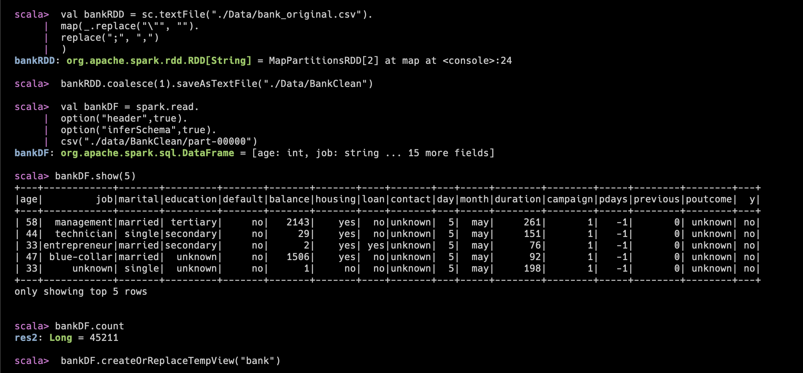
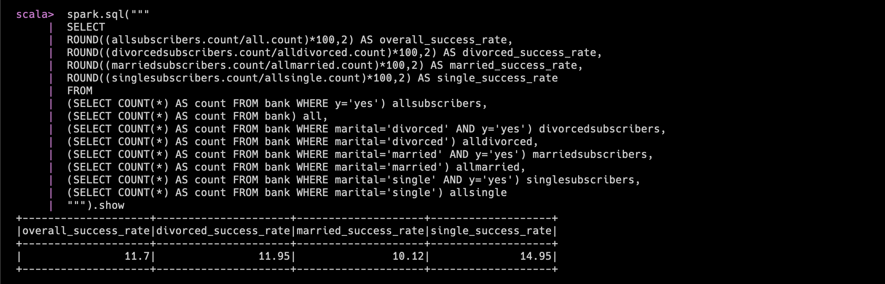
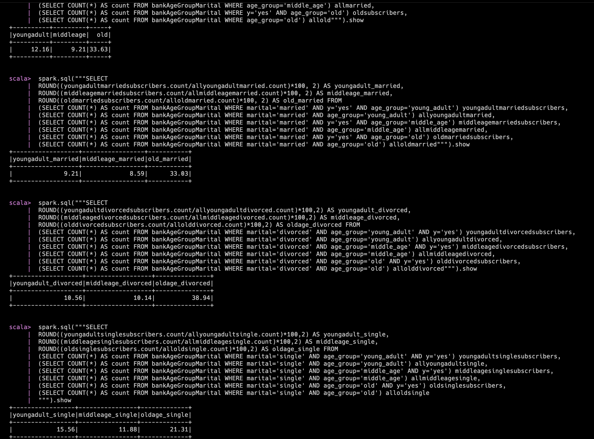
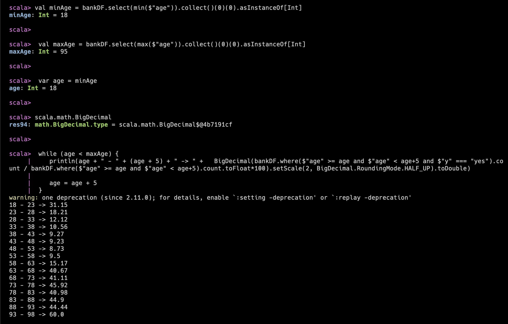

# MARKET ANALYSIS IN BANKING DOMAIN
## Ashish Rai

---
# Setup

---
# Campaign Performance
- Success Rate **11.7%**
- Failure Rate **88.3%**

---
# Customers Age Statistics
- Minimum **18**
- Maximum **95**
- Average **40.94**

---
# Customer Quality Check (Balance)
- Due to skewness, we can conclude that most of the customers belong to **lower** than average income strata.

---
# Does Age matter?
- Due to significantly low difference between average age of subscribers vs non-subscribers, we can conclude that age is **not significant** factor for campaign success.

---
# Does Marital status matter?
- **Single** customers have higher average chance to respond positively, concluding that marital status does matter.

---
# Does Age + Marital status matter?
- **(Old + Married or Divorced)** customers give significantly higher positive reponse to subscription deposit scheme.

---
# Age for target marketing
- Old age customers i.e **60+ years** 

---
# END